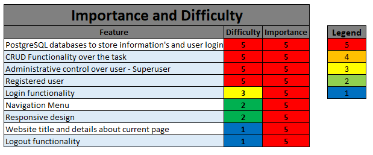

# ✔️ Project Management System 📔

## [See Live web](TBA)

# Introduction

Welcome to my Fourth Full Stack Course project. This is a Project Management System.

The inspiration for this project was my site learning process of becoming a certified SCRUM master. As a SCRUM Master, one of the most needed items is to have an area to collect and monitor workload, progress, roadblocks.

# Table of Contents

[**1. UX**](#ux)
* [**1.1. Strategy**](#strategy)
    * [**1.1.1 Project Goals**](#projectGoals)
    * [**1.1.2 User Stories**](#userStories)

* [**1.2. Structure**](#structure)
* [**1.3. Skeleton**](#skeleton)
* [**1.4. Color Scheme**](#colorScheme)

[**2. Features**](#features)

[**3. Technologies Used**](#technologies)

[**4. Testing**](#testing)
* [**4.1 PEP8**](#pep)
* [**4.2 Manual Testing**](#manualTesting)
* [**4.3 Function tests**](#functionTest)

[**5. Development Cycle**](#development)

[**6. Deployment**](#deployment)

[**7. End Product**](#endProduct)

[**8. Known Bugs**](#knownBugs)
* [**8.1 Fixed bugs**](#fixedBugs)
* [**8.1 Remaining Bugs**](#remainBugs)

[**9. Credits**](#credits)

[Back to Table Of Content](#tableOfContents)

# **1. UX**

[Back to Table Of Content](#tableOfContents)

# **1.1 Strategy**

##  **1.1.1 Project Goals**

## **1.1.2 User Stories **

# **1.2. Structure**

# **1.3. Skeleton**

diagram below:

[Back to Table Of Content](#tableOfContents)

# **1.4. Color Scheme**

[Back to Table Of Content](#tableOfContents)

# **2. Features**

[Back to Table Of Content](#tableOfContents)

Importance and Difficulty table:

# **3. Technologies Used**

During creation journey I did use:

* [Chrome](https://www.google.com/intl/en_uk/chrome/)
    * Chrome dev tool used to debug and test code while building
* [Github](http://github.com)
    * For storing project code written in gitpod
* [W3School](https://www.w3schools.com/)
    * For problem solving and code searching
* [PEP8 validator](http://pep8online.com/)
    * For checking python convention
* [Heroku](https://id.heroku.com/login)
    * To deploy project into live environment

[Back to Table Of Content](#tableOfContents)

# **4. Testing**

## **4.1 PEP8**

[Back to Table Of Content](#tableOfContents)

## **4.2 Manual testing**

[Back to Table Of Content](#tableOfContents)

## **4.3 Function tests**

# **5. Development Cycle**

[Back to Table Of Content](#tableOfContents)

# **6. Deployment**

To deploy my final project to the cloud I used Heroku. To do this I had to:

1. Push the latest code to GitHub.
2. Go to Heroku
3. Select new in the top right corner.
4. Create new app.
5. Enter the app name and select Europe as the region.
6. Connect to GitHub.
7. Search for repo-name.
8. Select connect to the relevant repo you want to deploy.
9. Select the settings tab.
10. Add buildpack
11. Select Python, then save changes.
12. Select Nodejs, then save changes.
13. Make sure Heroku/Python is at the top of the list, followed by Heroku/Nodejs
14. Navigate to the deploy tab
15. Scroll down to Manual Deploy and select deploy branch.

[Deployed version](TBA)

[Back to Table Of Content](#tableOfContents)

# **7. End Product**

## **End Product screens**

[See testing photos](#functionTest) for more end product photo.

[Back to Table Of Content](#tableOfContents)

# **8. Known bugs**

## **8.1 Fixed bugs**

## **8.2 Remaining Bugs**

[Back to Table Of Content](#tableOfContents)

# **9. Credits**

Heroku deployment instructions from Code Institute

GitHub Python Template [Code Institute](https://codeinstitute.net/)

