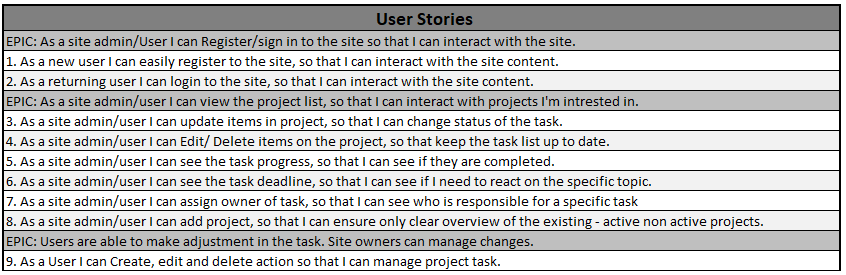
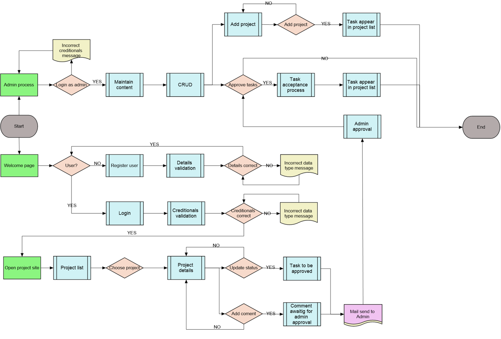

# ✔️ Project Management System 📔

## [See Live web](https://project-task.herokuapp.com/)

# Introduction

Welcome to my Fourth Full Stack Course project. This is a Project Management System.

The inspiration for this project was my site learning process of becoming a certified SCRUM master. As a SCRUM Master, one of the most needed items is to have an area to collect and monitor workload, progress, roadblocks.

Project is built with concept of being a product like tool capable to adjust according to the customer needs.

# Table of Contents

[**1. UX**](#ux)
* [**1.1. Strategy**](#strategy)
    * [**1.1.1 Project Goals**](#projectGoals)
    * [**1.1.2 User Stories**](#userStories)

* [**1.2. Structure**](#structure)
* [**1.3. Skeleton**](#skeleton)
* [**1.4. Color Scheme**](#colorScheme)

[**2. Features**](#features)

[**3. Technologies Used**](#technologies)

[**4. Testing**](#testing)
* [**4.1 PEP8**](#pep)
* [**4.2 Manual Testing**](#manualTesting)
* [**4.3 Function tests**](#functionTest)

[**5. Development Cycle**](#development)

[**6. Deployment**](#deployment)

[**7. End Product**](#endProduct)

[**8. Known Bugs**](#knownBugs)
* [**8.1 Fixed bugs**](#fixedBugs)
* [**8.1 Remaining Bugs**](#remainBugs)

[**9. Credits**](#credits)

[Back to Table Of Content](#tableOfContents)

# **1. UX**

As a next step on my path of becoming a software developer from zero to hero 😊, I'm presenting a Project Manager Tool.
As mentioned in my last projects my ultimate goal is to change my career path and become a full-time developer. Here I will be showing my new acquired skill, which is Django.
As part of my portfolio collection, which can be shown to my potential future employers, and potentially be used by myself. I have decided to build a product that can support day to day workload of Project Managers or SCRUM masters. As a first part of this will be creating project task manager, where all projects can be collected and monitored during each project. 

[Back to Table Of Content](#tableOfContents)

# **1.1 Strategy**

##  **1.1.1 Project Goals**

A project goal was to create a to set PM tool belt were project task can be monitored, this page have a potential to build more tools in upcoming project 5 were additional features like Gantt Chart, Critical Path, Delay Calculator, and Task Time Calculator will be added.

The reason for this web page is to create tool which I can use as a potential PM SCRUM master in the future also to create product which can be a sellable. 

## **1.1.2 User Stories **

# **1.2. Structure**

# **1.3. Skeleton**

diagram below:

[Back to Table Of Content](#tableOfContents)

# **1.4. Color Scheme**

[Back to Table Of Content](#tableOfContents)

# **2. Features**

[Back to Table Of Content](#tableOfContents)

•	Responsive design
•	Navigation Menu (Site Wide)
•	Postgress databases to store information and user login/profile information
•	CRUD Functionality
•	Filter list details functionality
•	Filter due date range
•	Hiding filter once not in use
•	Login functionality
•	Logout functionality
•	Register functionality

Importance and Difficulty table:

# **3. Technologies Used**

During creation journey I did use:

* [Chrome](https://www.google.com/intl/en_uk/chrome/)
    * Chrome dev tool used to debug and test code while building
* [Github](http://github.com)
    * For storing project code written in gitpod
* [W3School](https://www.w3schools.com/)
    * For problem solving and code searching
* [Stack Overflow](https://stackoverflow.com/)
    * For problem solving and code searching
* [PEP8 validator](http://pep8online.com/)
    * For checking python convention
* [Heroku](https://id.heroku.com/login)
    * To deploy project into live environment
* [Cloudinary](https://cloudinary.com/)
    * To store static files 

[Back to Table Of Content](#tableOfContents)

# **4. Testing**

## **4.1 PEP8**

[Back to Table Of Content](#tableOfContents)

## **4.2 Manual testing**

[Back to Table Of Content](#tableOfContents)

## **4.3 Function tests**

# **5. Development Cycle**

Page was building based on diagram and user stories. The first days of this project I was focused with installing packets and building the connection with a database & cloudinary. Once build the connection with database I did deploy project to Heroku to avoid potential error with deployed version.

CRUD functionality over task list was a next phase of this implementations, to ensure user is capable to manipulate data by adding, updating, deleting and marking as completed to have a full control over a data.

Adding Calendar picker to due date field to avoid potential issues with typing date in the different way as is expected by form as well as improve UX by delivering visual ability to locate chosen date on the calendar it self.

As per Agile approach the next features appear during next iteration cycle where an issue with building a separate way to store Projects in form of the list to have ability to standardize projects naming convention and keep control over a data and future task creation.
Tu ensure the project data is also coming under a CRUD functionality I decided to build it in the class view model, which give me an opportunity to learn this approach in real situation.

Filter option was implemented to reduce a displayed data and to give a better end user experience.
To avoid overwhelming number of displayed data the pagination was implemented.

[Back to Table Of Content](#tableOfContents)

# **6. Deployment**

To deploy my final project to the cloud I used Heroku. To do this I had to:

1. Push the latest code to GitHub.
2. Go to Heroku
3. Select new in the top right corner.
4. Create new app.
5. Enter the app name and select Europe as the region.
6. Connect to GitHub.
7. Search for repo-name.
8. Select connect to the relevant repo you want to deploy.
9. Select the settings tab.
10. Add buildpack
11. Select Python, then save changes.
12. Select Nodejs, then save changes.
13. Make sure Heroku/Python is at the top of the list, followed by Heroku/Nodejs
14. Navigate to the deploy tab
15. Scroll down to Manual Deploy and select deploy branch.

[Deployed version](TBA)

[Back to Table Of Content](#tableOfContents)

# **7. End Product**

## **End Product screens**

[See testing photos](#functionTest) for more end product photo.

[Back to Table Of Content](#tableOfContents)

# **8. Known bugs**

## **8.1 Fixed bugs**

During development I did face multiple bugs:
   * Issue with page rendering (Ger)
      Page wasent rendering due to lack of implementing url by using jinja template
   * Extending base.html template to allauth html files
      Issue with a file structure and which was not able to pull details from base.html
   * Display CSS setting in the Heroku deployed version (Alan, John)
      Issue related with not using a correct folders structure, link to the static files was incorectly writen

   
No remainig bugs

## **8.2 Remaining Bugs**

No bugs remaining

All known bugs were corrected before deployment

[Back to Table Of Content](#tableOfContents)

# **9. Credits**

* Heroku deployment instructions from Code Institute
* Hello Django and Djngo blog from code institute
* Django Blog by Codemy
* Stack overflow to support with debugig
* CI Tutor Support for Help with
   * Issue with page rendering (Ger)
   * Extending base.html template to allauth html files
   * Display CSS setting in the Heroku deployed version (Alan, John)
* GitHub Python Template [Code Institute](https://codeinstitute.net/)
