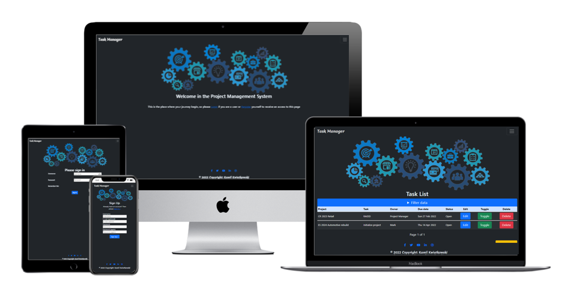
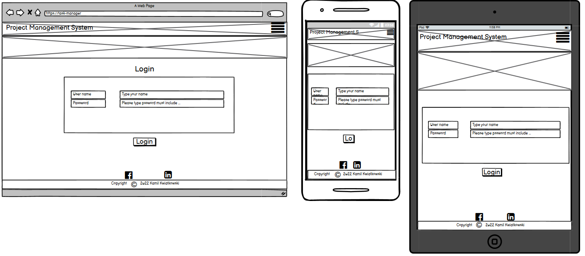
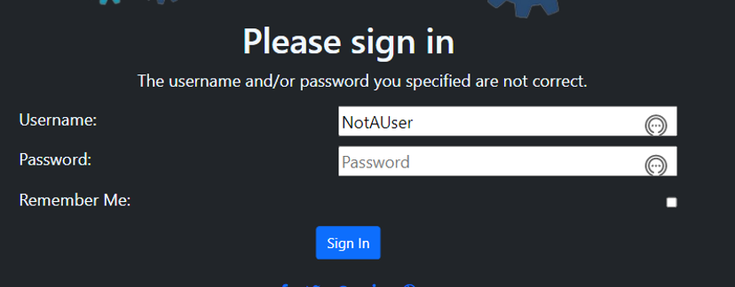
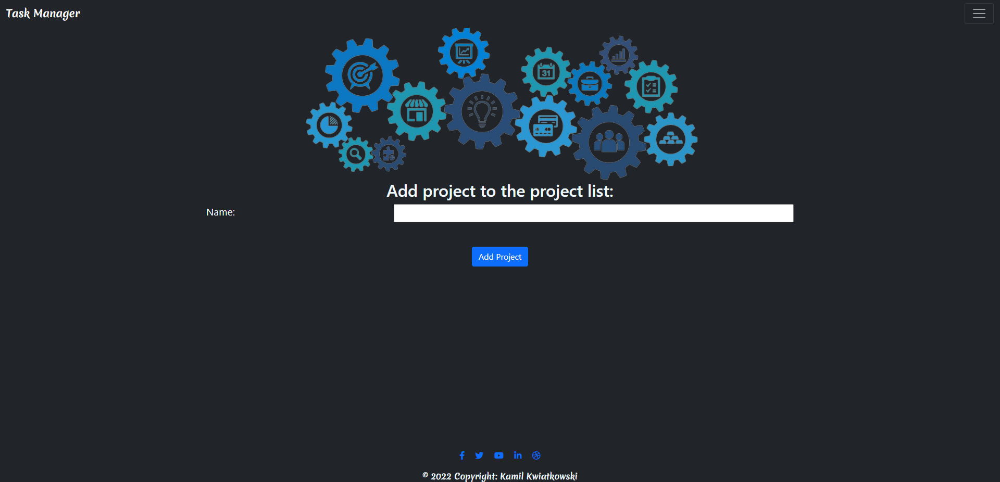
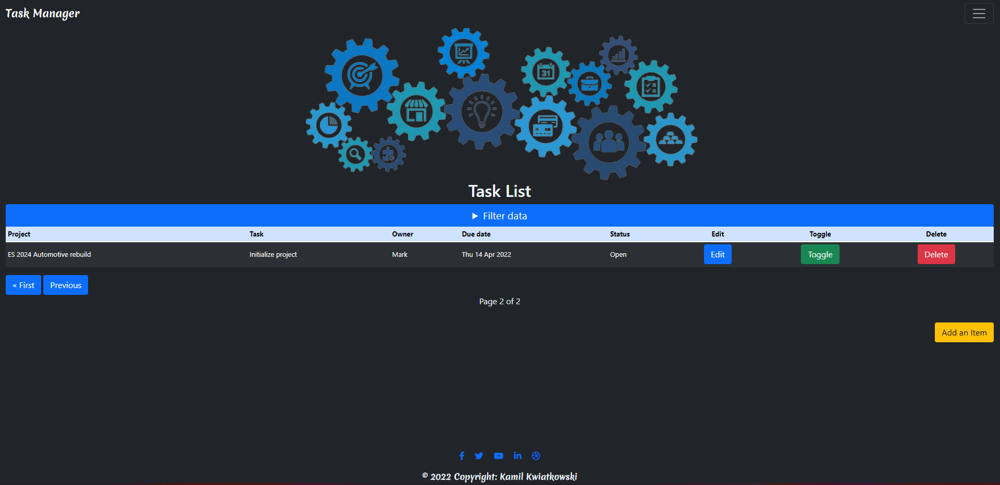
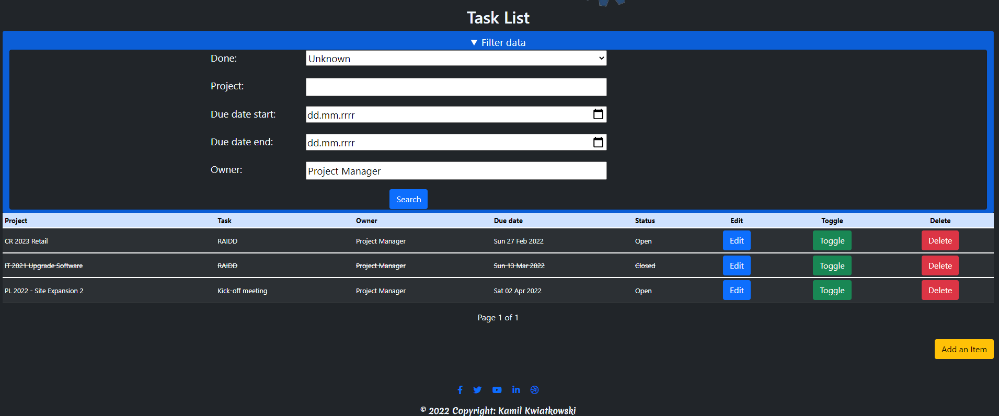
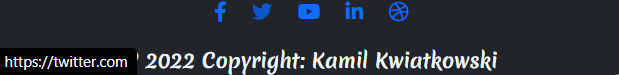
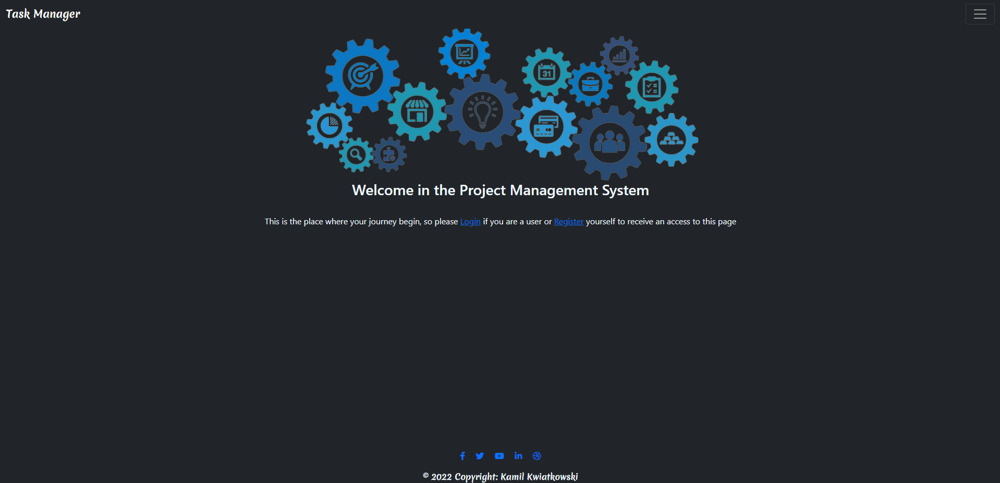
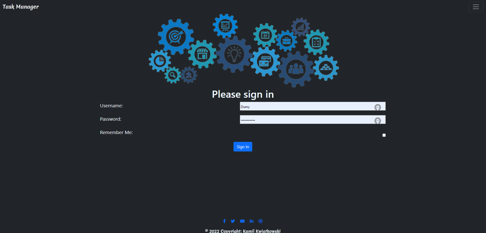

# ✔️ Project Management System 📔

## [See Live web](https://project-task.herokuapp.com/)

# Introduction

Welcome to my Fourth Full Stack Course project. This is a Project Management System.

The inspiration for this project was my side learning process of becoming a certified SCRUM master, as well as observation of project managers from my company using multiple trackers, which seemed impractical. As a SCRUM Master, one of the most needed items is to have a tool to collect and monitor workload, progress, and deadlines. The tool itself can be used in any project management world. In the current world, where Covid changed the way of doing the business and most of the things are done online, having a simple yet sufficient tool to track the progress of your team, project members and other function are essential to bringing efficiency to the company. 

The goal was to create a tool, which in the future can be adjusted according to the specific customer needs. 

# Table of Contents

[**1. UX**](#ux)
* [**1.1. Strategy**](#strategy)
    * [**1.1.1 Project Goals**](#projectGoals)
    * [**1.1.2 User Stories**](#userStories)
    * [**1.1.3 KANBAN - Agile**](#kanban)

* [**1.2. Structure**](#structure)
* [**1.3. Skeleton**](#skeleton)
* [**1.4. Color Scheme**](#colorScheme)
* [**1.5. Data Base**](#dataBase)

[**2. Features**](#features)

[**3. Technologies Used**](#technologies)

[**4. Testing**](#testing)
* [**4.1 PEP8**](#pep)
* [**4.2 Manual Testing**](#manualTesting)
* [**4.3 Function tests**](#functionTest)

[**5. Development Cycle**](#development)

[**6. Deployment**](#deployment)

[**7. End Product**](#endProduct)

[**8. Known Bugs**](#knownBugs)
* [**8.1 Fixed bugs**](#fixedBugs)
* [**8.1 Remaining Bugs**](#remainBugs)

[**9. Credits**](#credits)

[Back to Table Of Content](#tableOfContents)

# **1. UX**

As the next step on my path of becoming a software developer from zero to hero 😊, I'm presenting a Project Manager Tool. As mentioned in my last projects my ultimate goal is to change my career path and become a full-time developer. Here I will be showing my newly acquired skills, which are Django and DataBase. As part of my portfolio collection, which can be shown to my potential future employers, and potentially to be used by myself. I have decided to build a product that can support the day to day workload of Project Managers or SCRUM masters. The product is simple to use and intuitive, the navigation around the page is clear and gives users the ability to search and filter through things like date or status. The product can be adjusted in the future for specific customer needs, as well as certain features can be added if the business needs them. The current tool includes elements such as project name, task, due date, and owner. The tool can hold multiple projects, meaning the project manager or SCRUM master can have an overview of all actions open against each project they are working on. Having all in one space optimizes time and effort for task management.

[Back to Table Of Content](#tableOfContents)

# **1.1 Strategy**

#  **1.1.1 Project Goals**

A project goal was to create a set PM tool belt where project tasks can be monitored, this page has the potential to build more tools in upcoming project #5, where additional features like Gantt Chart, Critical Path, Delay Calculator, and Task Time Calculator could be added. Currently, the tool has abilities to store tasks against multiple projects, owners, and due dates. Users can select either a specific project or choose the owner of the task.
 
The reason for this web page is to create a tool that I can use as a potential PM SCRUM master in the future also to create a product that can be sellable. Therefore, in my thought process, I aimed to create a good basis in project #4 and expand on that in the future

## **1.1.2 User Stories - Agile**

## **1.1.3 KANBAN Dashboard - Agile**

# **1.2. Structure**

## **Wireframes**

### **Landing page**

### **Sign up page**

### **Login page**

### **Task List**

### **Add Task**

### **Project List**

### **Add Project**

# **1.3. Skeleton**

### **Diagram**

### **Diagram signup-login-logout**

### **Diagram CRUD**

### **Diagram filter**

[Back to Table Of Content](#tableOfContents)

# **1.4. Color Scheme**

* Color of body was: rgba(33, 37, 41, 1) the bs-gray-900 bootsrap pallet
* Image colors: mix of rgba(32, 149, 175, 1) rgba(41, 75, 113, 1) and rgba(30, 150, 113, 1)
* Font color: aliceblue

[Back to Table Of Content](#tableOfContents)

# **1.5. Database Design**

### **Database structure**

### **Security**

For security reasons, Database connection details are set up in an env.py. For production, these are stored in Heroku.

[Back to Table Of Content](#tableOfContents)

# **2. Features**

[Back to Table Of Content](#tableOfContents)

* Responsive design
* Navigation Menu (Site Wide)
* Postgress databases to store information and user login/profile information
* CRUD Functionality
* Filter list details functionality
* Filter due date range
* Hiding filter once not in use
* Pagination
* Login functionality
* Logout functionality
* Register functionality

### **Importance and Difficulty table**

# **3. Technologies Used**

During creation journey I did use:

* [Chrome](https://www.google.com/intl/en_uk/chrome/)
    * Chrome dev tool used to debug and test code while building
* [Github](http://github.com)
    * For storing project
* [Gitpod](https://gitpod.io/workspaces)
    * Code written in gitpod workspace
* [W3School](https://www.w3schools.com/)
    * For problem solving and code searching
* [Stack Overflow](https://stackoverflow.com/)
    * For problem solving and code searching
* [PEP8 validator](http://pep8online.com/)
    * For checking python convention
* [Heroku](https://id.heroku.com/login)
    * To deploy project into live environment
* [Cloudinary](https://cloudinary.com/)
    * To store static files
* [Markdown](https://en.wikipedia.org/wiki/Markdown)
    * To create project documentation
* [Python OS](https://getbootstrap.com/)
    * asgiref==3.5.0
    * backports.zoneinfo==0.2.1
    * cloudinary==1.28.1
    * coverage==6.3.1
    * dj-database-url==0.5.0
    * dj3-cloudinary-storage==0.0.6
    * Django==3.2
    * django-allauth==0.48.0
    * django-bootstrap-datepicker-plus==4.0.0
    * django-filter==21.1
    * gunicorn==20.1.0
    * oauthlib==3.2.0
    * psycopg2==2.9.3
    * PyJWT==2.3.0
    * python3-openid==3.2.0
    * pytz==2021.3
    * requests-oauthlib==1.3.1
    * sqlparse==0.4.2
* [Django](https://docs.djangoproject.com/en/4.0/)
    * This project was created using the Django framework, the back-end logic and the means to run/view the Website.
* [Bootstrap](https://docs.python.org/3/library/os.html)
    * To provide styles to page
* [balsamiq Wireframes](https://balsamiq.com/wireframes/)
    * To build wireframes
* [Font Awesome](https://fontawesome.com/)
    * Special Icons for links
* [Google Fonts](https://fonts.google.com/)
    * Google fonts are used in the project to import the Merienda font for the nav title.
* [Multi Device Website Mockup Generator](https://techsini.com/multi-mockup/index.php)
    * Multi Device Website Mockup Generator was used to create the Mock up image in this README

[Back to Table Of Content](#tableOfContents)

# **4. Testing**

## **4.1 Validators**

### **PEP8**

Code pass PEP8 without critical errors

### **W3C HTML**

Code pass W3C HTML without errors

### **W3C CSS**

Code pass W3C CSS without errors

[Back to Table Of Content](#tableOfContents)

## **4.2 Manual testing**

### **Sign Up test**

### **Sign up Page wrong user or password**

### **Sign up Page email exist**

### **Sign up Page user exist**

### **Sign up Page password too short**

[Back to Table Of Content](#tableOfContents)

### **Login test**

### **Login Page wrong user or password**

[Back to Table Of Content](#tableOfContents)
### **Project List**

### **Add Project**

### **Update Project**

### **Delete Project**

[Back to Table Of Content](#tableOfContents)
### **Task List**

### **Toggle button**

### **Edit Task**

### **Pagination**

[Back to Table Of Content](#tableOfContents)
### **Filter Area**

### **Done dropdown**

### **Project Filter**

### **Date Range Filter**

### **Owner Filter**

[Back to Table Of Content](#tableOfContents)
### **Link opener**

### **Link Facebook**

### **Link Twitter**

### **Link Youtube**

### **Link LinkedIn**

### **Link Dribbble**

[Back to Table Of Content](#tableOfContents)

## **4.3 Function tests**

Due to time constraints, the fully automatic test wasn't completed

### **Automatic Test**

### **First Automatic Test**

### **Second Automatic Test**
* Due to time limits additional tests are not implemented 

[Back to Table Of Content](#tableOfContents)

# **5. Development Cycle**

Page was built based on diagrams, user stories, and wireframes. In the first days of this project, I was focused on installing packets and building the connection with a database & Cloudinary. Once I built the connection with the database I did deploy the project to Heroku to avoid potential errors with the deployed version.
 
CRUD functionality over task list was the next phase of this implementation, to ensure the user is capable of manipulating data by adding, updating, deleting, and marking as completed to have full control over the information.
 
Adding Automatic test for CRUD functionality.
 
Adding Calendar picker to due date field to avoid potential issues with typing date in the different way as is expected by form, as well as improve UX by delivering visual ability to locate the chosen date on the calendar itself.
 
As per the Agile approach, the next feature appearing during the next iteration cycle was an issue with building a separate way to store Projects in the form of the list. This enabled users to have the ability to standardize project naming conventions and keep control over the data and future task creation.
 
To ensure the project data has CRUD functionality, I decided to build it in the class view model, which gave me an opportunity to learn this approach in a real situation.
 
The filter option was implemented to reduce displayed data and to give a better end user experience. To avoid an overwhelming number of displayed data the pagination was implemented.
 
Final bug fix run, where issues like registration error, query set conflicts were addressed.
 
The last stage of the process was styling the page in CSS and creating a ReadMe file.

[Back to Table Of Content](#tableOfContents)

# **6. Deployment**

### **Development Environment**

1. Create requirements.txt pip3 freeze --local > requirements.txt
2. Create Procfile.
3. Commit and push changes to Github.
4. Move to the Heroku part of a deployment.

### **To deploy my final project to the cloud I used Heroku. To do this I had to**

1. Push the latest code to GitHub.
2. Go to Heroku
3. Select new in the top right corner.
4. Create a new app.
5. Enter the app name and select Europe as the region.
6. Connect to GitHub.
7. Search for repo-name.
8. Select connect to the relevant repo you want to deploy.
9. Select the settings tab.
10. Add buildpack
11. Select Python, then save changes.
12. Make sure Heroku/Python is at the top of the list, followed by Heroku/Nodejs
13. Navigate to the deploy tab
14. Scroll down to Manual Deploy and select deploy branch.

### **Heroku Postgres Database**

1. Go to the Resources tab in Heroku.
2. Select Heroku Postgres from the Add-ons search bar
3. Choose the Hobby Dev-Free plan.
4. Click submit the order form.
5. Go back to Gitpod bash terminal and install
    * pip3 install dj_databse_url
    * pip3 install psycopg2-binary 
6. Seve in the requirements file by: 
    * pip3 freeze > requirements.txt

[Deployed version](TBA)

[Back to Table Of Content](#tableOfContents)

# **7. End Product**

## **End Product screens**

### **Landing Page**

### **Sign up page**

### **Login Page**

### **User not authenticated Page Menu**

### **User authenticated Home Page Menu**

### **Project List**

### **Add Project**

### **Update Project**

### **Delete Project**

### **Home Page**

### **Edit Task**

### **Sign out**

[See testing photos](#functionTest) for more end product photo.

[Back to Table Of Content](#tableOfContents)

# **8. Known bugs**

## **8.1 Fixed bugs**

During development I did face multiple bugs:

### **301 Redirect Error**

Error

Fix 

   
### **Issue with page rendering**

    * Page wasn't rendering due to lack of implementing url by using jinja template

Fix

* Extending base.html template to allauth html files
    * Issue with a file structure and which was not able to pull details from base.html

Fix

Moved the base.html to the main templates folder

Updated the other templates accordingly

### **Templates DIR typo**

* Typed DRI instead of DIR

Fix

* Display CSS setting in the Heroku deployed version (Alan, John)

* Issue related with not using a correct folders structure, link to the static files was incorrectly written

* Link to style sheet should be in the < head >

Fix

### **Setting.py, setting debug to:**

SECURITY WARNING: don't run with debug turned on in production!

DEBUG = "DEVELOPMENT" in os.environ

* env.py set os.environ["DEVELOPMENT"] = "True"

* import to urls.py 

from django.conf import settings

from django.conf.urls.static import static

urlpatterns = [
    path(......
] + static(settings.STATIC_URL, document_root=settings.STATIC_ROOT)

### **Conflict between filter and paginations**

* Caused by using the same query set – fixed by separating queries

Fix

   
## **8.2 Remaining Bugs**

### **Delay with updating project list, waiting time approx. 5 min - the solution was discovered a few hours before the project deadline, however, due to complexity and potential impact to the overall project deadline, the decision was made to do not introduce the fix.**

[Back to Table Of Content](#tableOfContents)

# **9. Credits**

* Heroku deployment instructions from Code Institute
* Hello Django and Django blog from code institute
* [Django Blog by Codemy](https://www.youtube.com/playlist?list=PLCC34OHNcOtqW9BJmgQPPzUpJ8hl49AGy)
* Stack overflow to support debugging
* CI Tutor Support for Help with
   * Issue with page rendering (Ger)
   * Extending base.html template to allauth html files
   * Display CSS setting in the Heroku deployed version (Alan, John)
* GitHub Python Template [Code Institute](https://codeinstitute.net/)
* [Bootstrap documentation](https://getbootstrap.com/docs/5.0/getting-started/introduction/)
* [Django documentation](https://docs.djangoproject.com/en/4.0/)
* Conflict Between pagination and filter deep understanding [Filtering and Pagination with Django](https://www.caktusgroup.com/blog/2018/10/18/filtering-and-pagination-django/)

* Coding Buddy @Matt_5P for mental support and help with issues during the process
